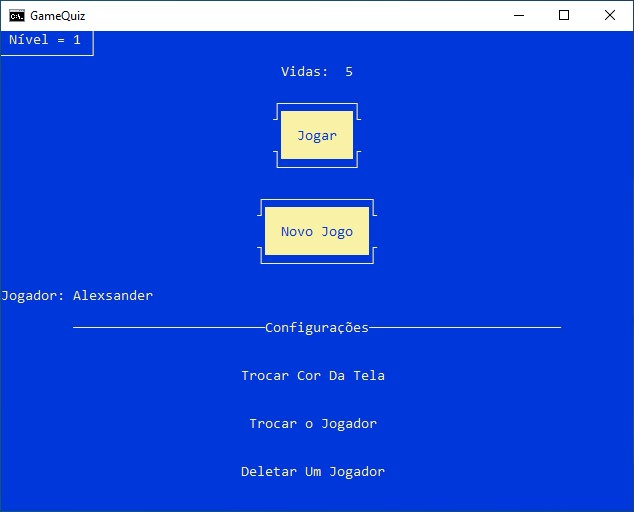
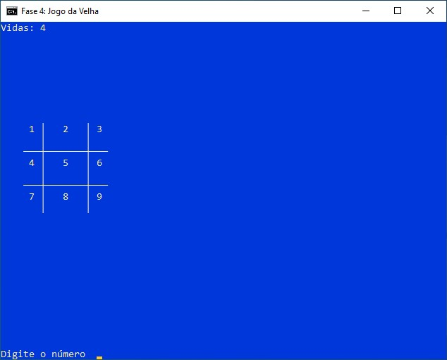
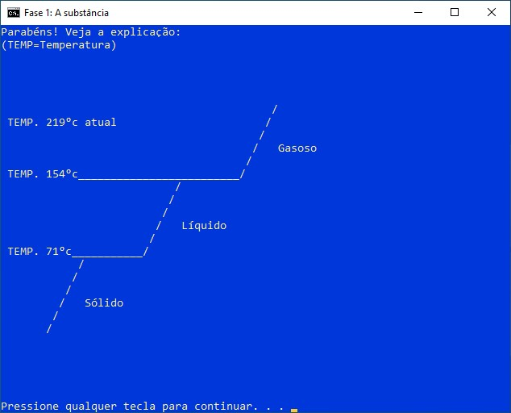

# GameQuiz

## Project Description

GameQuiz is a simple game developed using a Windows batch script (.bat) that offers a fun and nostalgic experience. This project was one of my first during my childhood and early adolescence. Despite its simplicity, it is functional and features several capabilities, including support for multiple player profiles, profile creation and deletion, and interactive mouse-controlled buttons.

<div>
    
</div>

## Features

- **Multiple Profiles Support**: Create and delete player profiles.
- **Mouse Interactivity**: Interactive buttons for a dynamic experience.
- **Lives and Levels Management**: Manage lives and progress through levels.
- **Customization**: Options to change the screen and text colors and switch the current player.
- **Unique Questions Per Profile**: Each profile generates questions differently. The concept of the question remains the same, but the answer varies. For example, one profile might get "What is 23+5?" while another profile on the same level might get "What is 41+9?".

##

<div>
    
</div>
*tic-tac-toe, one of the game's levels*

## How to Play

1. **Clone the repository**:
    ```bash
    git clone https://github.com/AlexsanderMe/game_quiz-batch.git
    ```
2. **Navigate to the project directory**:
    ```bash
    cd game_quiz-batch
    ```
3. **Run the game**: Open the `Jogo.bat` file to start GameQuiz.

## Menu Navigation

- **Play**: Start a game with the selected player.
- **New Game**: Create a new player profile.
- **Change Screen Color**: Change both the background and text color of the game screen.
- **Switch Player**: Change the active player.
- **Delete a Player**: Remove an existing player profile.

##
<div>
    
</div>
*with explanation of the answers*

## System Requirements

- Operating System: Windows

## Notes

   - Please note that this project was not fully completed. Feel free to modify it and add new levels if you wish.
   - This project demonstrates how creativity and programming logic can be applied early on using simple and accessible tools like Windows batch scripts. It serves as a great starting point for beginners exploring basic logic, flow control, and user interaction concepts.

## License

This project is licensed under the MIT License - see the [LICENSE](LICENSE) file for details.
